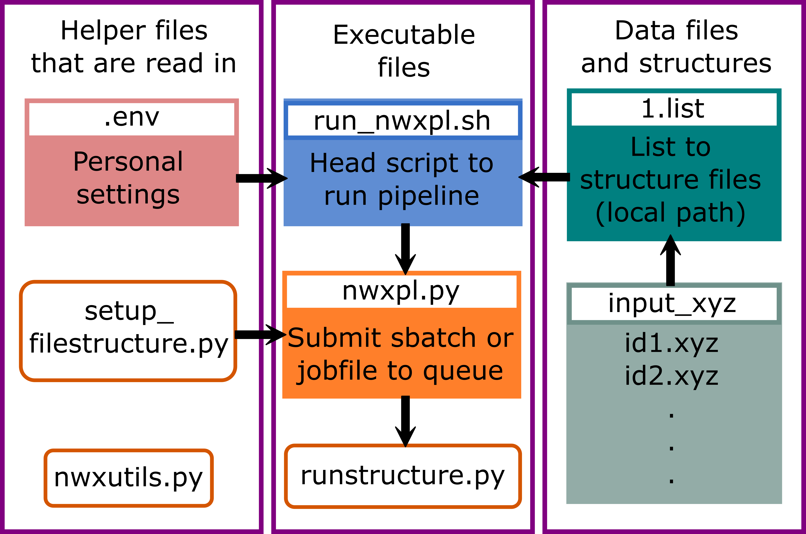

# Charles Branch, NWXPL (**NW**chem **X**-ray calculation **P**ipe**L**ine)

This pipeline has been edited to work on the macchiato cluster for a more updated version of NWChem.

This pipeline is set up to run 4-5 separate NWChem calculations using one job per structure, all of which is managed by python scipts.

## Pipeline capabilities

The NWChem calculations are the following (in order):

1. Geometry Optimization
2. Ground State Calculation
3. Valence-to-Core X-ray Emission Spectroscopy (VtC-XES)
4. X-ray Absoprtion Near-Edge Fine Structure (XANES)
5. (optional) ElectroStatic Potential (ESP)

## How to use the pipeline

1. Clone this repo onto your cluster of choice.
2. The `template` directory has template NWChem input files, filestrcutures, and a template job or sbatch file.
3. Modify the basis of your chosen element using the `basisfiles` directory.
4. Move all your structure files (in the form of `.xyz` files) to `ScriptedCalculations/input_xyz/`
5. List all these structure files in `1.list` using their local path, e.g., `input_xyz/CaCO3.xyz`.
6. Adjust the `.env` file with your preferences.
7. Run `run_nwxpl.sh` by, for example, using the command `./run_nwxpl.sh`.

#### The .env file

The .env file should look something like:

```
WORK_DIR=/home/working/
SCRATCH_DIR=/home/working/scratch/
OUT_DIR=/home/out/
EMAIL=myemail@gmail.com
```

If you use `EMAIL=None`, then you will **not** get an email notifcation when your job has completed.

#### The `tests` directory

Within `ScriptedCalculations/tests/` is an example of `1.list` and where to put your `xyz` files. Running `test_run.sh` within this directory will go through all of the python within the pipeline including copying over template files and manipulating them, but will **not** submit actual NWChem jobs.

# Basis sets

Choosing an appropriate basis set for your desired element can be done at https://www.basissetexchange.org/.

Select the element of your calculation and choose a basis set from the list on the left. Below the periodic table, you will have the option to get the basis set in a form appropriate for NWChem, which you can then copy to your clipboard or download.

# Flowchart of the pipeline

<p align="center">

</p>

## An example file structure

``` 
│
└───work
│   │
|   |───scratch
|   |   ...
|   |  
│   └───id1
│   │   │   esp
│   |   │   geometryoptimize
|   |   |   gndstate
│   |   │   xes
│   │   │   xanes
│   │   │   job.run
│   |   │   ...
│   |
│   └───id2
|   |   |   esp
│   |   │   geometryoptimize
|   |   |   gndstate
│   |   │   xes
│   │   │   xanes
│   │   │   job.run
│   |   │   ...
│   |	...
|
└───out
│   │
│   | id1.dat
|   | id2.dat
│   │ ...
│   
└───nwxpl
│   │
│   ...
```
